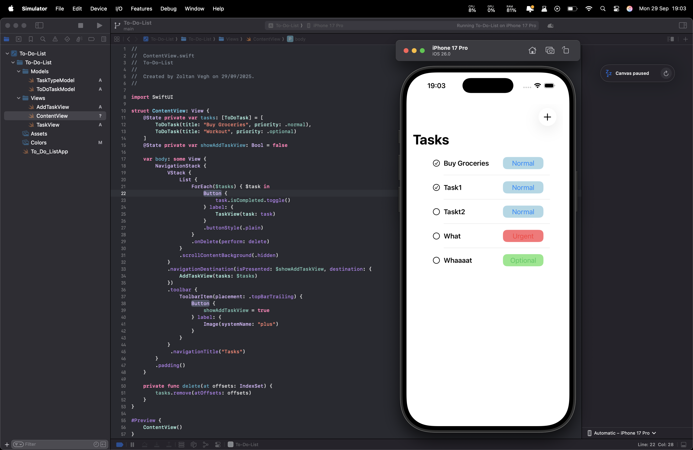
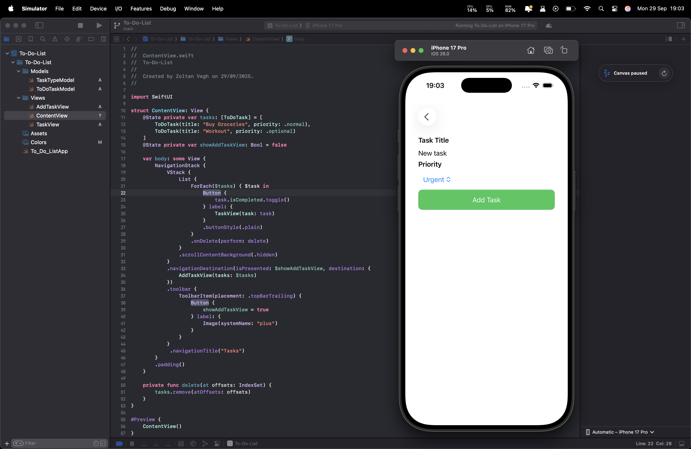

# To-Do List App (SwiftUI)

A simple and elegant **To-Do List app** built with SwiftUI.  
Users can easily **add new tasks, delete tasks, and mark them as done or not done**.  

---

## Features
- Add new tasks with a title and priority  
- Mark tasks as **completed / not completed**  
- Delete tasks with a swipe  
- Clean and modern **SwiftUI** interface  

---

## Screenshots

<p align="center">
  
  
</p>

---

## Getting Started

### Requirements
- iOS 17+
- Xcode 15+

### Installation
1. Clone the repo:
   ```bash
   git clone https://github.com/your-username/todo-list-swiftui.git
